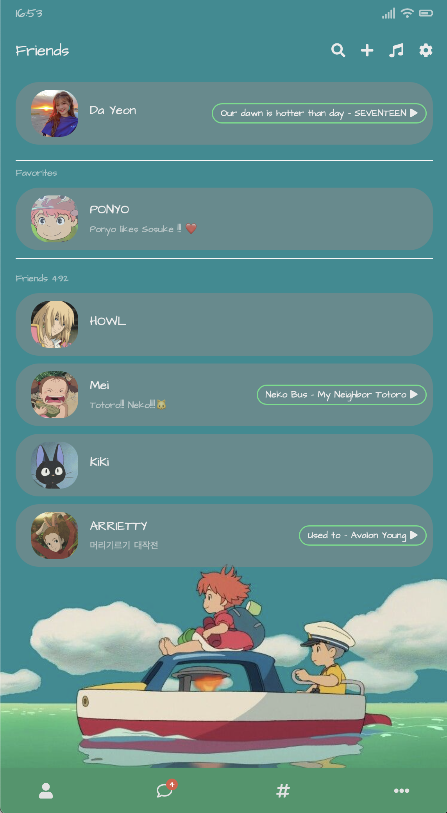
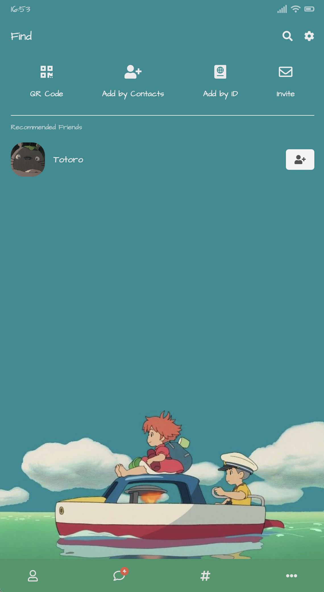

# Kakao-Clone-2.0
From Nomad Academy
 

## 📚 Summary
> 카카오톡을 클로닝하며 html, css 학습
> 📆 학습 기간 : 2020.01. ~ 2020.03.

## 🛠 Tech
- Only html, CSS
- IDE VSCode

## 📷 Design 

## 📸 ScreenShot
     

      

## 📌 Memo
- nav bar에서 첫번째 아이콘에 커서를 올리면 나머지 아이콘이 사라지는 버그
